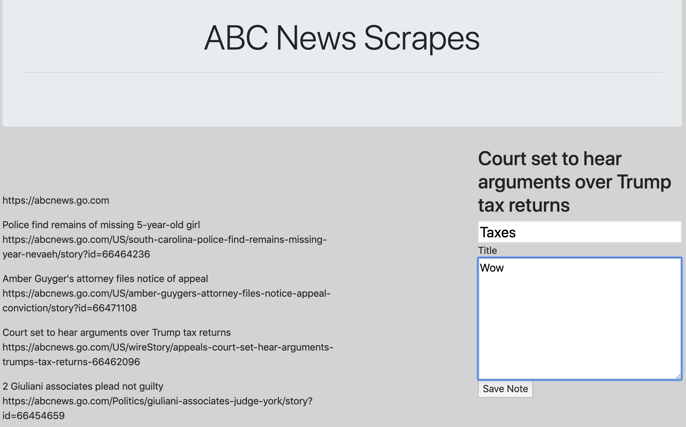

# News-Scrape

## Summary 

A project that showcases scraping from a website.

## Site Picture



## New Technologies Used

MongooseJS - Object modeling tool that creates a database.

Cheerio - Allows user to scrape information from websites. 

## Challenges and Future Development

Some of the challenges for this project going forward is that while the base functionallity does work, there are still areas that could be fixed. One challenge is to make it so that past articles will be deleted after a scrape. At the moment, any time a scrape is done, the articles appended will stay on the page even if you reset. 

Another challenge is inserting the articles and links in its own card. While trying to add cards, if added within handlebar tags (like {{#each}} ), the cards would not appear while the article title and link appears on the page. But testing outside the handlebars, the cards would appear as normal. 

## Code Snippet

An early challenge during the project was trying to find the correct parent and children tags for the scraping of articles. Some sites are very different than others so this was a process of trial and error. In this case, the parent tag was the "h1" tag while the "a" tags were the children. 

```js

app.get("/scrape", function (req, res) {
    axios.get("https://abcnews.go.com/").then(function (response) {
        var $ = cheerio.load(response.data);

        $("h1").each(function (i, element) {
            var result = {};

            result.title = $(this)
                .find("a")
                .text();

            result.link = $(this)
                .children("a")
                .attr("href");

            db.Article.create(result)
                .then(function (dbArticle) {
                    console.log(dbArticle);
                })
                .catch(function (err) {
                    console.log(err);
                });
        });

        res.send("Scrape Complete");
    });
});

